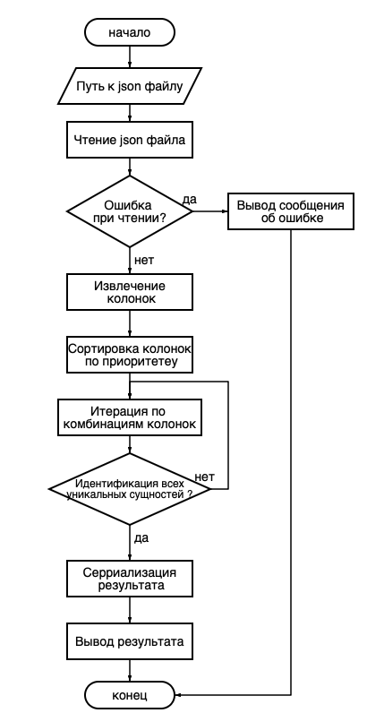

## Practice-Garpix: Поиск минимального набора идентифицирующих признаков

---

**Этот проект анализирует JSON данные и находит минимальный
набор признаков (атрибутов), которые однозначно идентифицируют каждую сущность.**


### Структура проекта:
`tests/test_app.py`: каталог с тестами для проверки работоспособности кода.

`app.py`: основной скрипт, содержащий алгоритм поиска и обработку аргументов командной строки.

`example.json`: пример JSON-файла с данными.

`docs`: каталог где хранится схема описания алгоритма.

---

### Как запустить:

```python
python app.py <путь_к_json_файлу>
```

  Пример:

  ```python
  python app.py example.json
  ```
  Результат (список идентифицирующих признаков) будет выведен в консоль строкой.
  

---

### Запуск тестов с помощью инструмента eqator:

```python
python manage.py qa
```
---

### Пример данных:

example.json:
```json
[
  {
    "фамилия":"Смирнов",
    "имя":"Евгений",
    "отчество":"Александрович",
    "класс":"6",
    "подгруппа":"1",
    "предмет":"История",
    "видДеятельности":"Учебная",
    "количествоЧасовВнеделю":"2"
  },
  {
    "фамилия":"Смирнов",
    "имя":"Евгений",
    "отчество":"Александрович",
    "класс":"7",
    "предмет":"История",
    "видДеятельности":"Учебная",
    "количествоЧасовВнеделю":"2"
  },
  {
    "фамилия":"Смирнов",
    "имя":"Евгений",
    "отчество":"Александрович",
    "класс":"8",
    "предмет":"История",
    "видДеятельности":"Учебная",
    "количествоЧасовВнеделю":"2"
  }
]
```
---

### Описание алгоритма:


1. Чтение данных из JSON-файла:
   - На вход алгоритма подаётся путь к JSON-файлу.
   - Проверяется содержит ли файл данные. Если файл пуст, алгоритм завершает выполнение без дальнейших действий.
2. Сортировка колонок по приоритету:
   - Колонки сортируются на основе предопределенного приоритета. Колонки, которые указаны в списке приоритета, будут рассмотрены первыми.
3. Поиск минимального уникального набора колонок:
   - Проверяются все возможные комбинации колонок, начиная с наименьших. 
   - Для каждой комбинации проверяется, уникальны ли записи при использовании только этих колонок.
   - Если комбинация колонок обеспечивает уникальность записей, то эта комбинация является минимальной уникальной.
4. Вывод результата:
   - Записываем минимальный набор уникальных колонок в CSV-файл. 
   - Вывод результата на экран.
